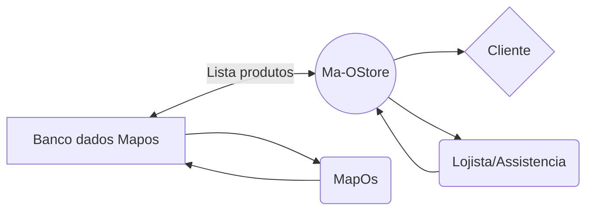

Aplicação para fins de estudo !!!

# Ma-Ostore

Olá, sejam bem vindos a minha primeira contribuição oficial ao mundo  **Opensource**. 

Esse projeto tem como objetivo criar uma vitrine online de produtos cadastrado no sistema de gestao de ordem de serviços **[Map-OS](https://github.com/RamonSilva20/mapos)**.

# Funções do sistema

Ele acessa ao bando de dados do MapOS e tras algumas informaçoes sobre os  **Produtos** e **Emitente**.

## HEADER /MENU NAVEGAÇÃO

Nessa seção ele ira trazer uma Imagem para supreender seu cliente no primeiro click .
### Logo
Ele retorna a Logo de sua empresa quando adicionada atraves do mapos no campo emitente. E ele é um botao que redireciona a pagina INDEX.PHP

### Pesquisa 
Traz um modal clean que busca todos seus produtos.

### Carrinho
Traz um modal clean que lista os produtos adicionados a sua lista de desejo. 

## BANNER

Traz uma experiencia ao usuario com uma imagem  e um titulo agradavel. Facilmente editavel no arquivo inc/site/index.php
**Ver Produtos** Desliza a tela ate a sessao de Produtos.
**Numero Telefone** Permite que o cliente ligue diretamente para sua empresa.
**Icones de Rede Social** Atalhos para suas redes sociais .

## PRODUTOS

Ele lista de uma forma aleatoria alguns de seus produtos 

## Veja mais produtos 

Te envia em uma pagina a qual mostra **todos seus produtos** podendo navegar entre elas no canto inferior da pagina.

**CLICAR NO NOME DO PRODUTO** Te envia para uma pagina a qual  informa mais detalhes deles.

### ADD AO CARRINHO

Inclui os Produtos a uma lista de desejos para que seja alterado a quantidade dos itens.

### FINALIZAR
Formata sua lista de desejo e envia diretamente via **WHATSAPP** cadastrado no emitente.

### FOOTER
Tras informaçoes sobre **EMITENTE** cadastrado.

## Diagrama

Mapos permite a edição das informaçoes no banco de dados.
MaOstore permite que visualize e efetue um pedido ao lojista.

